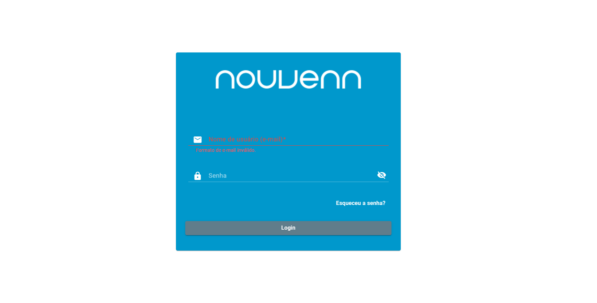
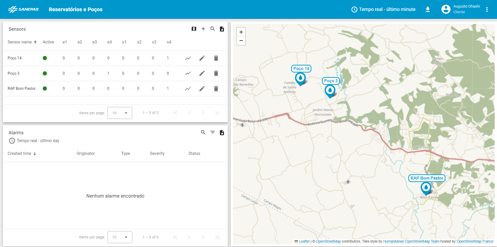
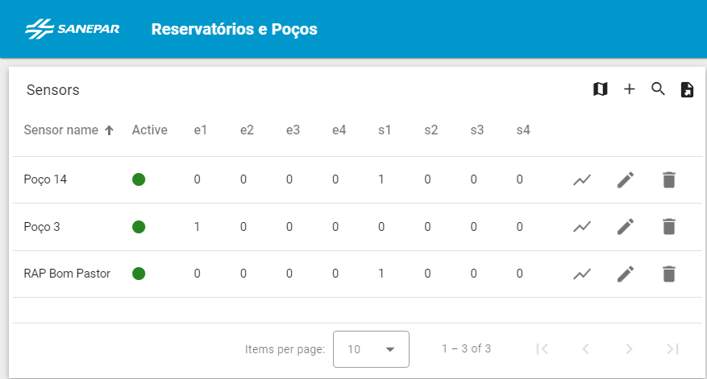
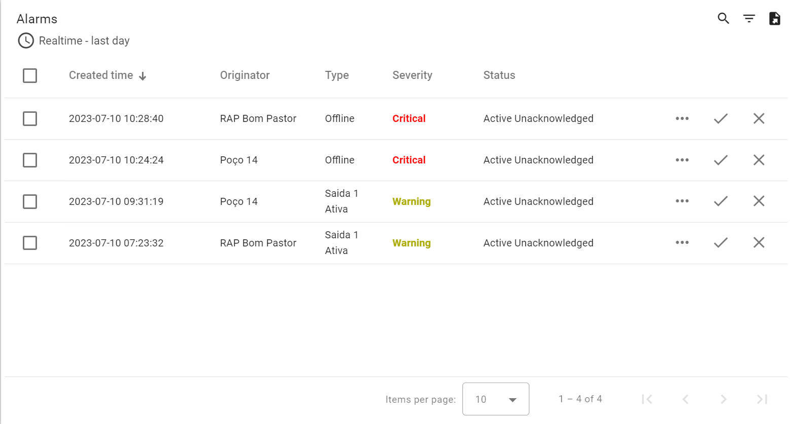
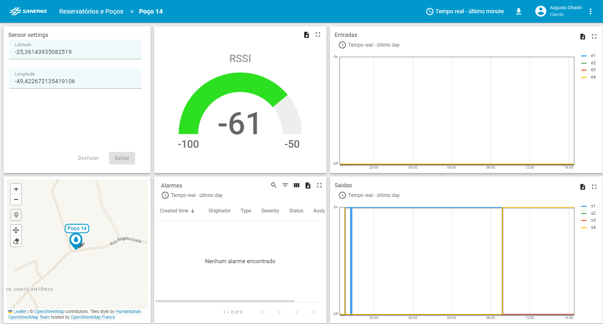

# Documentação WLM v1.0.0

Página de documentação da aplicação do projeto de monitoramento de subestações de água.

## Introdução
A solução de monitoramento de subestações de tratamento de água é uma ferramenta que permite acompanhar em tempo real o funcionamento e o desempenho das estações de tratamento e distribuição de água em uma região. Com essa solução, é possível identificar e corrigir falhas, otimizar processos, reduzir custos e evitar o desperdício de água. Essa documentação técnica tem como objetivo apresentar as principais funcionalidades, requisitos e instruções de uso da solução de monitoramento de subestações de tratamento de água.

## Instalação

Para instalar o equipamento, siga os seguintes passos:

1. Conecte uma fonte 12 no conector de alimentação do equipamento.
2. Identifique as 4 entradas de contato seco no equipamento e ligue os cabos correspondentes aos sensores que deseja monitorar. Os sensores devem fornecer um sinal de 12V quando acionados.
3. Identifique as 4 saídas de contato seco no equipamento e ligue os cabos correspondentes aos dispositivos que deseja controlar. Os dispositivos devem ser compatíveis com um sinal de 12V para acionamento lógico.
4. Ligue o equipamento e verifique se as entradas e saídas estão funcionando corretamente.

## Acesso

Logar na conta fornecida pela Nouvenn para ter acesso ao sistema:
- [https://wlm.nouvenn.com/login](https://wlm.nouvenn.com/login)

## Página Principal

Essa seção descreve a página principal da aplicação, que é a primeira tela que o usuário vê quando acessa o sistema. A página principal mostra um mapa interativo com a localização de todos os equipamentos instalados em campo, bem como as informações das entradas e saídas digitais de cada equipamento. Ao clicar em um equipamento no mapa serão exebidos detalhes sobre seu funcionamento e configuração. Além disso, a página principal também exibe alarmes que indicam possíveis problemas nos estados das saídas lógicas ou na conexão do equipamento com a plataforma via rede celular. Esses alarmes são atualizados em tempo real e podem ser filtrados por tipo, data e equipamento.

### Informações sobre sensores e atuadores

A exibição de valores de entradas e saídas da lista de equipamentos instalados fica na parte superior esquerda da página principal e mostra as informações sobre o estado de cada entrada e saída em tempo real. Essa parte permite que o usuário visualize rapidamente o estado geral da subestação e identifique possíveis problemas ou anomalias.

### Alarmes

A seção de alarmes é uma área que mostra informações importantes sobre o funcionamento do dispositivo. Ela fica no canto inferior esquerdo da página principal e exibe os alarmes que ocorrem quando as saídas lógicas são ativadas ou quando o dispositivo perde a conexão com a rede.

## Detalhes Sensor

Nessa página, o usuário poderá visualizar o histórico de dados das entradas e saídas digitais do equipamento, que mostram o estado dos sensores e atuadores conectados ao dispositivo. Também poderá verificar o nível de sinal de conexão à rede celular, que indica a qualidade da comunicação entre o equipamento e a plataforma. Além disso, o usuário poderá editar a localização geográfica do equipamento, que permite identificar a sua posição no mapa. Por fim, poderá ver os alarmes configurados para o equipamento, que alertam sobre possíveis problemas ou situações anormais.

## Licença

Informe a licença sob a qual o software está sendo distribuído.
